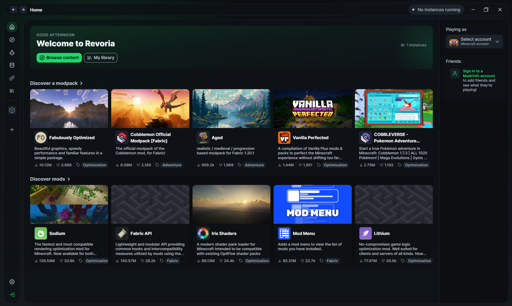
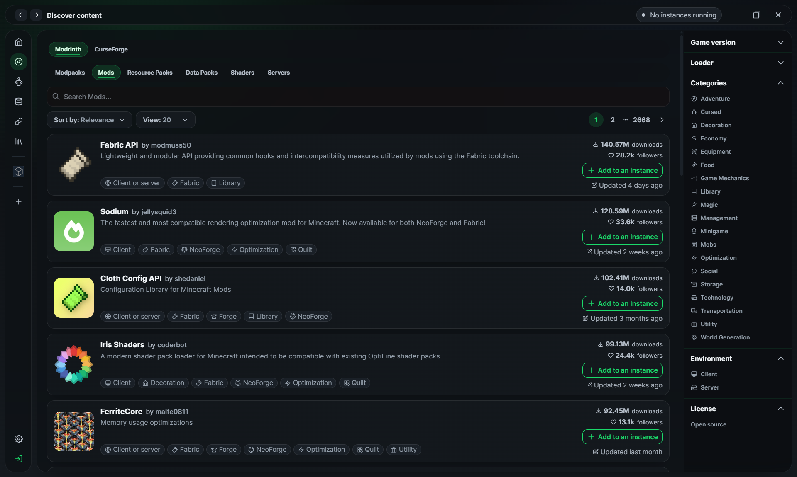

# Revoria

> 🚀 Самый мощный форк лаунчера Modrinth для тех, кому нужны контроль, скорость и современный интерфейс без мусора.

## 📚 Навигация

- [✨ О проекте](#-о-проекте)
- [🔥 Почему Revoria](#-почему-revoria)
- [⚙️ Ключевые возможности](#️-ключевые-возможности)
- [🖼️ Скриншоты](#️-скриншоты)
- [📦 Установка](#-установка)
- [🚀 Быстрый старт](#-быстрый-старт)
- [🤖 Ollama API Key (AI Crash Checker)](#-ollama-api-key-ai-crash-checker)
- [🔗 Ссылки проекта](#-ссылки-проекта)
- [🙏 Благодарности](#-благодарности)
- [⚠️ Дисклеймер](#️-дисклеймер)
- [💸 Поддержка автора](#-поддержка-автора)

## 🌍 Другие языки

- [English](../../README.md)

---

## ✨ О проекте

**Revoria** - это глубоко переработанный лаунчер на базе экосистемы Modrinth / Theseus, ориентированный на реальные задачи игроков, сборщиков и тех, кто любит тонкую настройку.

Проект поддерживается **sawiq**.

- Репозиторий: https://github.com/imsawiq/Revoria
- Релизы: https://github.com/imsawiq/Revoria/releases

---

## 🔥 Почему Revoria

Revoria создан для тех, кому важны:

- 🎨 новый, чистый и современный интерфейс;
- 🛠️ больше контроля над памятью, профилями и настройками лаунчера;
- 📦 поддержка CurseForge рядом с Modrinth;
- 🌐 полноценная русская локализация и дальнейшее расширение языков;
- 🤖 встроенный AI-анализ crash-логов;
- 🔐 поддержка офлайн-аутентификации;
- 🚫 отсутствие рекламы;
- ⚡ множество удобных улучшений по всему лаунчеру.

---

## ⚙️ Ключевые возможности

- 🎨 Полностью обновлённый интерфейс.
- 🧠 Улучшенные инструменты управления памятью.
- 📦 Поддержка CurseForge.
- 🌐 Полноценная поддержка русского языка.
- 🤖 AI Crash Log Checker через Ollama API.
- 🖼️ Вкладка со скриншотами в сборках и инстансах.
- 🔄 Синхронизация файлов и папок между сборками.
- 🔐 OFFLINE AUTH.
- 🚫 NO ADS.
- 🎮 Discord Rich Presence.

---

## 🖼️ Скриншоты

### Главный экран

### Поиск контента

---

## 📦 Установка

1. Откройте релизы: https://github.com/imsawiq/Revoria/releases
2. Скачайте файл под вашу ОС.
3. Установите и запустите.

### Форматы

- `.msi` / `.exe` - Windows
- `.dmg` - macOS
- `.deb` - Linux

---

## 🚀 Быстрый старт

1. Запустите Revoria.
2. Войдите через Microsoft-аккаунт **или** используйте офлайн-режим.
3. Создайте или выберите сборку.
4. Устанавливайте моды, ресурспаки и шейдеры из поддерживаемых источников.
5. При необходимости включите синхронизацию общих файлов и папок.
6. Играйте.

---

## 🤖 Ollama API Key (AI Crash Checker)

Чтобы использовать AI-анализ crash-логов:

1. Авторизуйтесь на https://ollama.com/
2. Перейдите в раздел ключей: https://ollama.com/settings/keys
3. Нажмите **Add API Key**
4. Скопируйте ключ и вставьте его в `Revoria -> Crash Log Checker -> API key`

---

## 🔗 Ссылки проекта

- GitHub: https://github.com/imsawiq/Revoria
- Релизы: https://github.com/imsawiq/Revoria/releases
- Канал поддержки: https://t.me/sawiq

---

## 🙏 Благодарности

Revoria основан на кодовой базе AstralRinth App и её развитии в рамках стека Theseus / Modrinth launcher.

Референс-релиз:

- https://git.astralium.su/didirus/AstralRinth

---

## ⚠️ Дисклеймер

- Revoria предоставляется для образовательных, тестовых и кастомных сценариев использования.
- Проект не поддерживает пиратство. Поддерживайте Minecraft и авторов контента легальными лицензиями там, где это требуется.
- Все сторонние API, платформы и материалы принадлежат их правообладателям.

---

## 💸 Поддержка автора

Если хотите поддержать разработку:

https://www.donationalerts.com/r/sawiq

USDT TRC20 - TPHqfb18BAqX7wegakp7sv8e4WWWTuJ4rM

TON - UQArPRrBLhA3GCyhZt0LUU3AGWsBl6l_L2v9gBUmls3HQyoq
